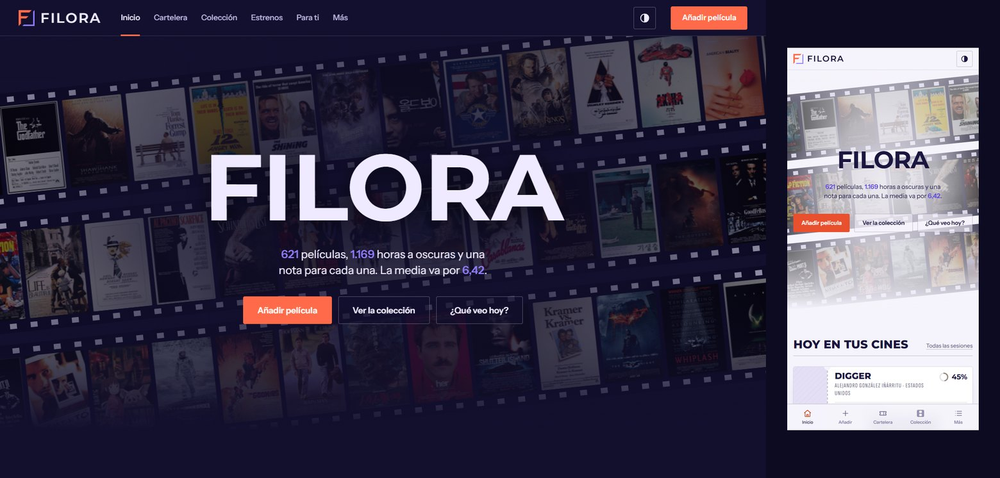

<p align="center">
  <picture>
    <source media="(prefers-color-scheme: dark)" srcset="docs/logo-oscuro.png">
    
  </picture>
</p>

<p align="center"><b>Mi diario de cine.</b> Colección puntuada, estadísticas, gustos, recomendaciones y la cartelera de Gijón.</p>

<p align="center"><a href="https://filora.vercel.app">filora.vercel.app</a></p>



## Qué hace

- **Colección**: más de 600 películas y series con carátula, nota, géneros y taquilla (Box Office Mojo).
- **Añadir**: como en el Excel; escribes el título y la carátula y los datos se completan solos.
- **Cartelera y estrenos**: sesiones reales de Ocine Los Fresnos y Yelmo Ocimax Gijón, y estrenos en España, actualizados cada día.
- **Para ti**: recomendaciones con la nota que predice que le pondrías.
- **Estadísticas y gustos**: notas, décadas, géneros, directores…
- **App instalable** (PWA), funciona sin conexión, con tema claro y oscuro, en móvil, tableta y ordenador.
- **Excel sincronizado** (`Filora.xlsx`) en el PC.

## Uso

En el PC (Python 3.10+ y `pip install openpyxl`):

```bash
python server.py
```

O doble clic en `Iniciar.bat` → http://localhost:8765

La web pública está en Vercel: se lee sin contraseña y se edita con PIN (`EDIT_PIN`), con los datos en Vercel Blob.

## Estructura

```
app/        interfaz web (HTML, CSS y JS sin dependencias) y PWA
api/        API para Vercel
server.py   servidor local + Excel + copias de seguridad
tools/      importación, enriquecimiento, cartelera, taquilla
data/       base de datos y estrenos
```
